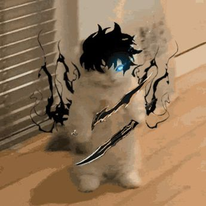

# ✨ Abhinay Giri ✨✨✨ - Developer

  

  <b>umm joyboy here - never forget to smile</b>

---

I don't take long to figure things out.

Read all about me here: <b><a href="https://withabhinay.me">Portfolio</a></b> 
Would love to share my notes: <b><a href="https://abhi-blog.vercel.app/">Notes</a></b> :)

---

<h2 align="center">🧠 Tech Stack</h2>

<table>
<tr>
<th>Category</th>
<th>Tech Stack</th>
</tr>

<tr>
<td><b>Languages</b></td>
<td>
  
  
  
  
  
  
</td>
</tr>

<tr>
<td><b>Productivity Systems</b></td>
<td>
  
  
  
  
  
</td>
</tr>

<tr>
<td><b>Toolkit</b></td>
<td>
  
  
  
  
  
  
  
</td>
</tr>

<tr>
<td><b>Frontend</b></td>
<td>
  
  
  
  
  
</td>
</tr>

<tr>
<td><b>Backend</b></td>
<td>
  
  
  
  
  
</td>
</tr>

<tr>
<td><b>DevOps & Cloud</b></td>
<td>
  
  
  
  
</td>
</tr>

<tr>
<td><b>Community</b></td>
<td>
  
  
  
  
</td>
</tr>

<tr>
<td><b>Social Links</b></td>
<td>
  
  
</td>
</tr>

</table>

---

<h2 align="center">🥷 About Me</h2>

<table>
<tr>
<td width="60%">

🥷 I am a developer who loves anime  

🛠️ I love building stuff — from scratch. From idea to architecture to deployment.  

🔍 Reverse engineering systems, breaking them apart to understand how they work, then rebuilding them smarter.  

💾 Recently started loving how machines are learning and trying to beat us. ML feels like the next battlefield.  

🌿 Apart from that, you will find me in nature — running, walking, thinking, resetting.  

Here is my **[CV](https://withabhinay.me/resume)**  

</td>

<td width="40%" align="center">

</td>
</tr>
</table>

---

<h2 align="center">📊 GitHub Stats</h2>

  

  

  

---

  <i>just wanted to add this master peice of one peice</i>

  

---

## 🤔 FAQs 🤔

### Which Code Editor do I use?
VS Code. Of course. It's the best.

### Which OS do I use?
I use Arch btw on my desktop computer.  
While traveling, I have my Macbook in my backpack.

### Why am I so diverse?
I love working on projects that build our future. I stay on a topic that interests me for some time and go deep into it. Then I explore something new but stay connected to the previous ones. I don't like missing out on anything.

### What more do I do outside my computer?
Running & football — call me anytime for this. I'm in.

### What do I do when I get bored?
I watch anime, YouTube, or have long discussions with my friends about tech, ideas, and random theories.

---

<h2 align="center">🚀 Currently Exploring</h2>

• System design 
• Distributed systems 
• Machine learning fundamentals 
• Low-level programming

---

<h2 align="center">🎭 ✨</h2>

  

  <b>System wants me to do that.</b>

  

  guess the character — hint: not exactly an anime 👀

